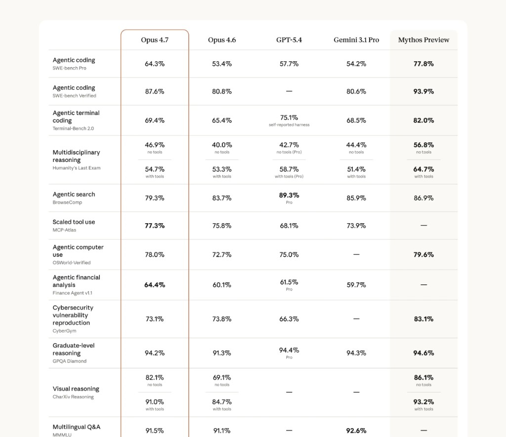
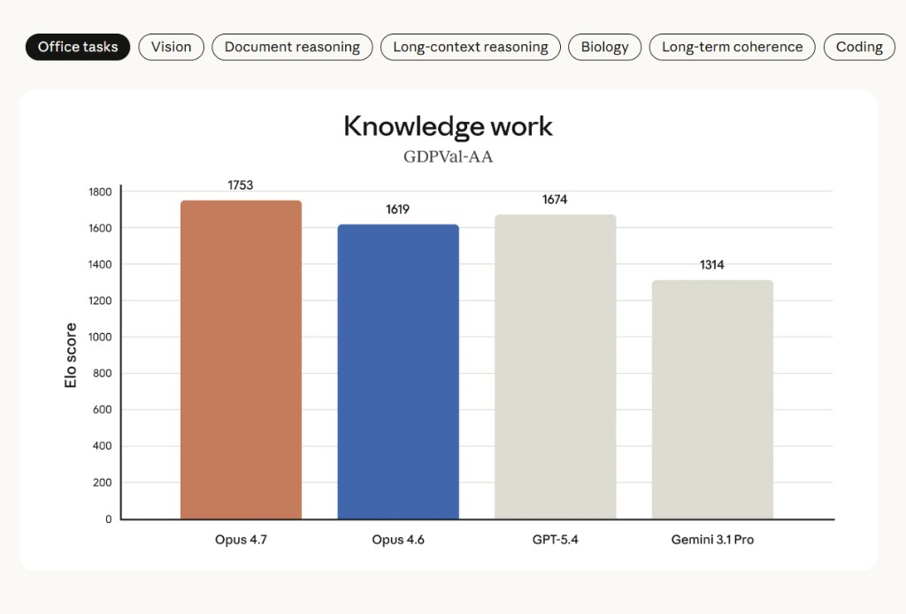
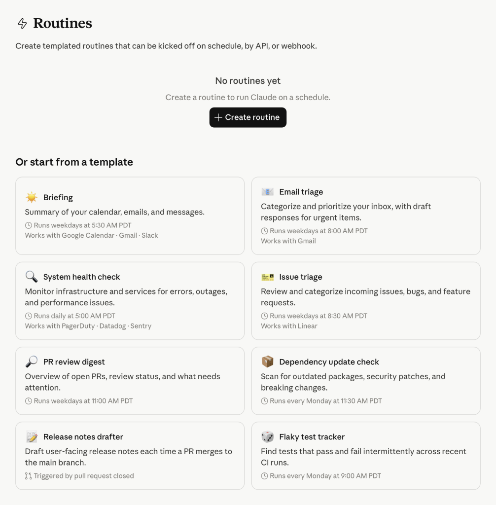
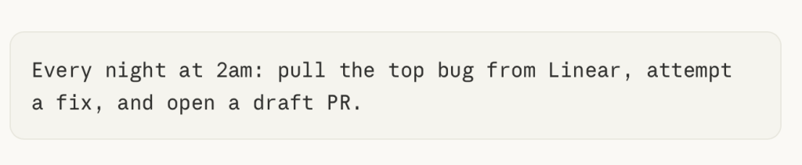
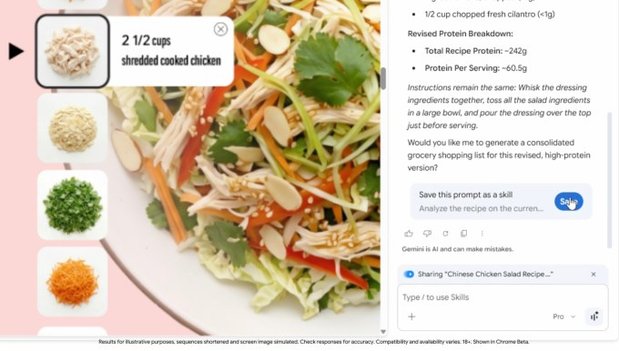
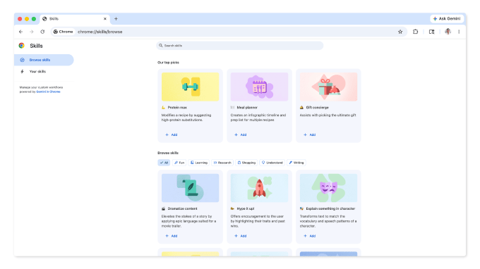
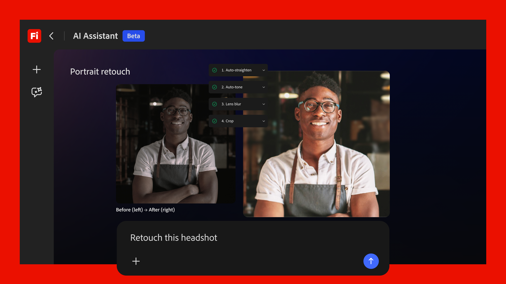
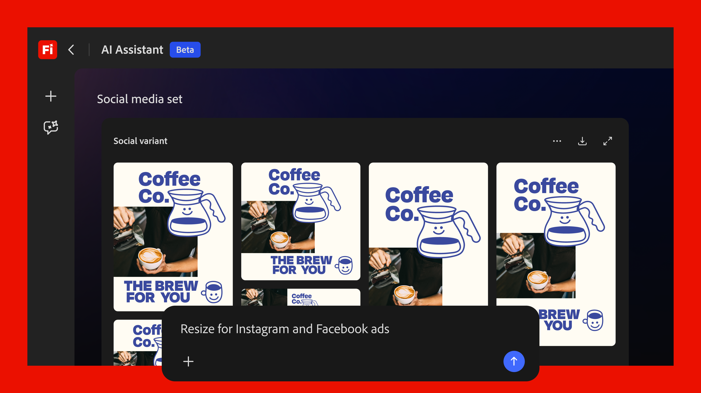
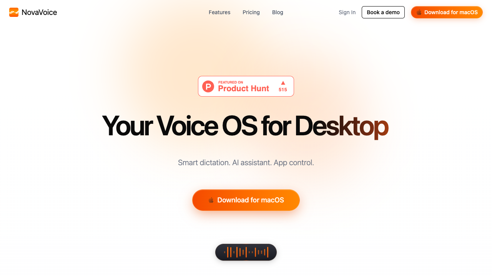

# AI 周报

> **2026/04/10 – 04/16**
> **本期主题：模型竞争进入工程深水区；Skill 层被三家大厂同时做成产品**

---

## 本周结论

> **核心判断：** 模型竞争正式进入**<mark>工程能力深水区</mark>**（Opus 4.7 SWE-bench 87.6%），同时 **<mark>Skill 层被三家大厂同时产品化</mark>**（Chrome Skills / Claude Code Routines / Adobe Creative Skills）——从单点能力到可编排工作流，这个转变本周集中发生了。

---

## 模型模块

### M1｜Claude Opus 4.7

| 模块 | 具体详情 |
|------|---------|
| 总结 | Anthropic 发布的新旗舰模型，用 SWE-bench Verified **87.6%** <mark>把工程场景的能力基准拉高了一个台阶</mark>，价格不变。 |
| 模型能力 | ● 更强的工程能力：SWE-bench Verified **87.6%**（对比 Opus 4.6 的 80.8%、GPT-5.4 的 77.2%）；SWE-bench Pro **64.3%** ● 更强的 Agent 长任务：Terminal-Bench 2.0 **69.4%**；新增自验证机制——模型在执行前自己跑一遍证明，之前的模型没有这个行为 ● 更强的视觉：分辨率提升至 ~3.75MP（3× 提升）；XBOW 视觉精度从 54.5% 跳到 **98.5%** ● 更擅长知识工作：GDPVal-AA Elo **1753**（GPT-5.4: 1674，Gemini 3.1 Pro: 1314） |
| 产品功能 | ● 已同步上线 Claude API、Amazon Bedrock、Google Vertex AI、Microsoft Foundry ● 新 tokenizer 带来 API breaking change，token 用量增加 1.0–1.35× ● Claude Code Desktop 同步重构为并行 session + Routines 自动化（见 P1） ● 新增 Cyber Verification Program，安全研究者可用于漏洞研究 |
| 新使用场景 | ● 复杂代码库的长时间自主修复——从"辅助写代码"到"独立完成工程任务" ● 高分辨率视觉理解：设计稿审阅、复杂图表分析、文档扫描 ● 多文件多 session 的 agent 工作流，配合 Routines 实现定时自动化 |
| 商业模式 | 价格不变：输入 **$5** / 输出 **$25** 每百万 token。能力大幅提升但不加价，用性能优势争夺份额。 |
| 用户反馈 | 好：● 工程能力领先幅度明确可量化 ● 价格不变是强竞争力信号 ● 多平台同步可用降低迁移风险 坏：● 新 tokenizer 的 breaking change 增加升级成本 ● Adaptive thinking 争议大，有用户反映模型在不该省思考的时候省了 ● 稳定性报告不一，有开发者遇到严重幻觉 |
| 与我们的关系 | 核心能力提升（agent 长任务、多文件工程、视觉理解）与我们的 context + skill + 创作工作流方向高度对齐。配合 Claude Code Routines 提供从"单次调用"到"可持续运行的 agent 系统"的完整路径。 |

*Opus 4.7 各维度 benchmark 对比（来源：Anthropic 官方）*

*知识工作 Elo 排名，Opus 4.7 以 1753 分领先（来源：Anthropic 官方）*

| 官方声明 | 外部验证 |
|---------|---------|
| SWE-bench 87.6%, Terminal-Bench 69.4%, 视觉 3× 提升, 价格不变 | AWS Bedrock 确认数据；iWeaver 独立对比逻辑错误率 9.1% vs GPT-5.4 的 11.4%；CursorBench 58%→70% |

| 社区反馈 | 编辑判断 |
|---------|---------|
| HN 讨论活跃；tokenizer 变更和 adaptive thinking 是主要争议点 | 本周最重要的模型事件，能力提升集中在最有价值的维度 |

> "关掉 adaptive thinking 用更高的默认 thinking 后，4.6 的质量终于回来了，4.7 目前看着很满意。不管他们内部评测怎么说，adaptive thinking 测的不是对的东西。" — HN 用户

> "在 CursorBench 上 Opus 4.7 是能力的显著跳跃，从 4.6 的 58% 到了 70%。" — Michael Truell，Cursor CEO

> "Opus 4.7 把长时程自主性提升到了新水平，能连贯工作数小时，遇到困难会坚持推进而不是放弃。" — Scott Wu，Devin CEO

> "这大概是发布过的最不稳定的技术了……有些天模型会'发疯'，出现严重幻觉。" — HN 用户

---

## 产品模块

本周产品密度极高，三条 agent 化路径同时出现，指向同一结论：**从单点能力到可编排的工作流技能层。**

### P1｜Claude Code Desktop + Routines

| 模块 | 具体详情 |
|------|---------|
| 总结 | Anthropic 对 Claude Code Desktop 做了架构级重构，<mark>从单一对话窗口变成支持并行 session 的"开发者指挥台"</mark>，同时发布了 Routines 定时自动化。 |
| 核心定位 | 开发者 AI agent 编排中枢——同时管理多个 repo 的代码修复、重构、测试任务。 |
| 产品重点 | ● 并行 Session：侧边栏管理所有活跃/历史任务，支持筛选分组，PR 合并后自动归档 ● Routines：prompt + 仓库 + 连接器打包为定时任务，cron / API / GitHub 事件触发，**无需机器在线** ● Side Chat：分支提问不污染主线程上下文（Cmd + ;） ● 内置终端 + diff 查看器 + SSH 支持（Mac/Linux） |
| 用户场景 | ● 设置 Routine 实现"夜间自动跑回归测试 + 生成修复 PR" ● 远程 SSH session 中完成整个开发-测试-部署循环 |
| 商业模式 | Pro / Max / Team / Enterprise 用户可用。Routines 在 research preview 阶段，需开启 Claude Code web。 |
| 用户反馈 | 好：● 多任务并行直接回应开发者长期痛点 ● Routines 是真正的自动化而非 demo 坏：● Routines 仍 research preview，稳定性和定价不明 ● 并行 session 对 token 消耗的影响未公开 |
| 与我们的关系 | Routines 的设计（prompt + 仓库 + 连接器 = 可调度自动化）与我们的"可复用 skill + 定时运行"几乎同构，既是参照物也是潜在技术底座。 |

*Claude Code Routines 实际配置界面：prompt + 仓库 + 触发器打包为定时自动化（来源：The New Stack）*

*Claude Code Desktop 并行 session 管理——侧边栏显示活跃任务（来源：The New Stack）*

> "当工程师从一对一使用 agent 转向并行管理多个 agent 时，这正是能解锁新工作流的那种前沿能力。" — Jeff Wang，Cognition CEO

> "同一天 HN 上出现了大量'我转到 Codex 了'的回复——部分开发者质疑 Claude Code 的可靠性是否值得生态锁定。" — HN 讨论

---

### P2｜Google Chrome Skills

| 模块 | 具体详情 |
|------|---------|
| 总结 | Google 在 Chrome 中推出 Skills 功能，让用户把常用 Gemini prompt 保存为一键可复用技能，支持多标签页批量执行。<mark>浏览器开始变成 skill runtime</mark>。 |
| 核心定位 | 浏览器原生的轻量 AI 技能层，把一次性 prompt 固化为可跨页面执行的技能组件。 |
| 产品重点 | ● 从 Gemini 聊天历史一键保存 prompt 为 Skill ● 侧边栏 `/` 或 `+` 快速调出已保存技能 ● 多标签页同时执行同一 Skill ● Skills Library 预置模板库（规格对比、营养计算、PDF 扫描），可自定义 |
| 用户场景 | ● 跨多标签页比对产品规格和价格 ● 长文档 / PDF 快速扫描提取关键信息 ● 把"prompt 资产"沉淀为可复用技能库 |
| 商业模式 | 免费，Chrome / Gemini 生态增强。商业价值在于提升 Gemini 在浏览器内的使用频率。 |
| 用户反馈 | 好：● 零门槛（免费 + 内置 Chrome）● 多标签页执行是真正新交互 坏：● 仅英文 US / 仅桌面端 ● 本质仍是 prompt 工具而非 agent |
| 与我们的关系 | Skills Library + 多标签页执行模式可直接作为我们设计 skill UX 的参照。最值得注意的不是它能做什么，而是全球最大浏览器把 skill 层当原生基建。 |

*Chrome Skills 实际产品界面：从聊天历史保存 prompt 为可复用 Skill（来源：Google / TechCrunch）*

*Chrome Skills Library：预置技能模板，覆盖生产力、购物、健康等场景（来源：Google / TechCrunch）*

> "Google 为 Gemini API 开发者添加了官方 Skills 包——这基本上就是浏览器里的 prompt-as-code。" — r/vibecoding

---

### P3｜Adobe Firefly AI Assistant

| 模块 | 具体详情 |
|------|---------|
| 总结 | Adobe 发布 Firefly AI Assistant，把 Photoshop / Premiere / Illustrator / Lightroom / Express 抽象成单一对话驱动的 agent 工作流。<mark>创作软件开始被 agent 统一</mark>。 |
| 核心定位 | 统一的创意 agent 入口——描述目标，系统在多个 Adobe 应用间自动规划和执行多步工作流。 |
| 产品重点 | ● 自然语言描述目标，agent 自动选工具和步骤 ● ~100 个内置 tools & skills，agent 自行决定用法 ● Creative Skills：常用创作链路固化为可复用多步技能 ● 原生可编辑输出（PSD / AI / Premiere），不是扁平导出 ● 集成 30+ 行业 AI 模型（Kling 3.0 / Runway / ElevenLabs） |
| 用户场景 | ● "做一套社媒素材"：一句话触发裁切 + 扩图 + 多平台适配 + 优化导出 ● "把这张图变成一个 15 秒短视频"：跨 Firefly → Premiere → Express |
| 商业模式 | 尚未公开定价，"未来几周 public beta"。更可能提升 Creative Cloud 订阅的粘性和高级层价值。 |
| 用户反馈 | 好：● 把 creative agent 做成了真实产品形态而非概念 demo ● 原生可编辑输出解决"AI 生成 = 一次性"痛点 坏：● 尚未开放，无法判断稳定性 ● Firefly 图像生成质量在 Reddit 上评价偏低 |
| 与我们的关系 | Creative Skills 概念与我们的"可复用创作 skill"同构。它直接击中工作流中心、上游创作编排、skill 复用层。 |

*Firefly AI Assistant：自然语言描述目标，agent 跨应用编排工作流（来源：Adobe 官方博客）*

*Creative Skills：预置多步创作技能，一个 prompt 触发完整工作流（来源：Adobe 官方博客）*

> "用 Firefly Boards 做故事板——在扎根原创作品的前提下保持风格一致性方面效果不错，但精确控制仍然困难，需要到其他工具做二次精修。" — r/Design 用户

> "Firefly 生成的图在美感上是几个主流工具里最差的，跟 Midjourney 和 DALL-E 比需要多得多的迭代。" — r/Adobe 用户

---

## 本期初创聚焦｜NovaVoice — Voice OS

| 模块 | 具体详情 |
|------|----------|
| 总结 | Product Hunt #1（**558 票**）。<mark>把语音做成桌面操作系统级交互层</mark>：**200+ WPM 听写** + 跨 10+ 应用语音指令，三平台覆盖。 |
| 核心卖点 | ● **200+ WPM 听写**（约 4× 键盘打字速度）● 上下文感知格式化：邮件 → 正式语气、Slack → 口语、Notion → Markdown ● 跨 10+ 应用语音指令：Gmail / Calendar / Todoist / VS Code 等 ● Windows / macOS / Linux 三平台覆盖 |
| 使用场景 | ● 长文档写作 / 邮件回复 / 代码注释 全部用语音完成 ● 开会时同步整理会议纪要与待办 ● 视障或轻度重复性劳损（RSI）用户的替代输入方案 |
| 商业模式 | 桌面订阅制，早期采用者定价未完全公开。PH 发布当天 558 票位列日榜 #1，冲榜策略明显。 |
| 用户反馈 | 好：● 听写准确率 + 格式化策略被多次点赞 ● 跨应用指令是真正新交互 坏：● Product Hunt 第一天热度 ≠ 长期留存 ● 语音系统权限依赖重，隐私与企业合规路径未明 ● 目前仅英文体验 |
| 与我们的关系 | 所有人都在做"打字 prompt → AI 生成"，NovaVoice 在试"说话 → 系统执行"。如果语音成为 AI 时代的第一输入方式，它是需要跟踪的起点；短期还不是我们 skill 方向的竞争者。 |

*NovaVoice：桌面语音操作系统，200+ WPM 听写 + 跨应用语音指令（来源：ChatGate / Product Hunt）*

---

## 简讯

| 名称 | 一句话 |
|------|-------|
| **Figma for Agents** | Figma 开放画布给 AI agent（MCP），PH 日榜一 499 票 |
| **Gemini Mac App** | Google 原生 Swift 桌面应用，Option+Space 唤起，免费 |
| **OpenAI Agents SDK** | harness + sandbox 更新，支持 MCP 和 AGENTS.md |
| **Fonic** | 散乱输入 → 交互式报告，MCP 集成，PH 85 票 |
| **GPT-5.4-Cyber** | GPT-5.4 安全特化版本，Trusted Access 受限分发 |
| **Gemini 3 更新** | Deep Think / TTS / 多语言 / Workspace 渐进改善 |

---

## 编辑部判断

**趋势**

1. **模型竞争进入工程深水区。** "最难工程任务上谁最强"替代"通用 benchmark 谁高一点"成为选型依据
2. **Skill 层成为产品基建。** Chrome / Claude Code / Adobe / Figma 四家同一周用了相同概念——范式趋同
3. **受限分发成新常态。** OpenAI + Anthropic 同周推 Cyber 特化版——最强能力 = trusted access

**项目动作**

- **本周必做：** <mark>上手 Claude Code Routines + Chrome Skills</mark>
- **等待跟进：** <mark>Adobe Firefly beta 深度测试</mark>
- **V1 方向：** <mark>锁定窄创作链路</mark>（素材整理 → 风格参考 → brief 生成），做第一个可复用 skill

**下周监控**

- Opus 4.7 在 Artificial Analysis 的首次评分
- Routines 从 preview → GA 进展
- Adobe Firefly beta 时间线
- DeepSeek V4 是否发布

---

## 参考来源

### 模型
- Anthropic｜Introducing Claude Opus 4.7｜2026-04-16
- AWS｜Opus 4.7 on Bedrock｜2026-04-16
- OpenAI｜Trusted access for cyber defense｜2026-04-14

### 产品
- Anthropic / MacRumors｜Claude Code Parallel Sessions｜2026-04-15
- Google Chrome Blog｜Skills in Chrome｜2026-04-14
- Adobe Blog + Newsroom｜Firefly AI Assistant｜2026-04-15
- The Verge / TechCrunch / VentureBeat｜报道｜2026-04
- Product Hunt｜Figma for Agents / NovaVoice｜2026-04
- HN｜Opus 4.7 讨论 (#47793493)｜2026-04-16
