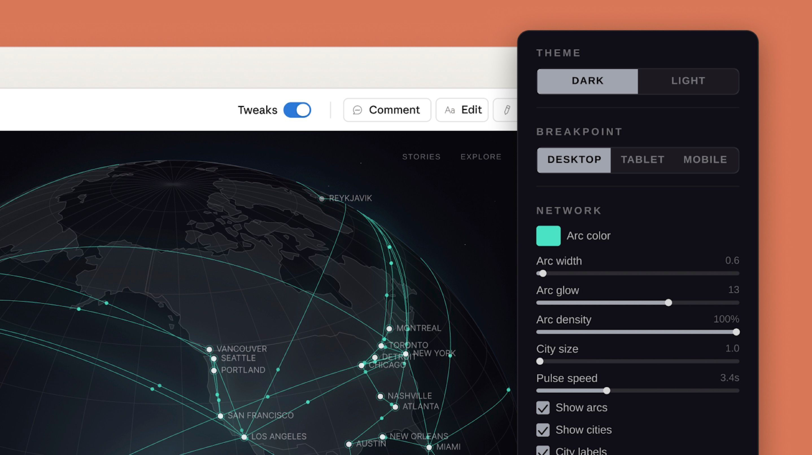
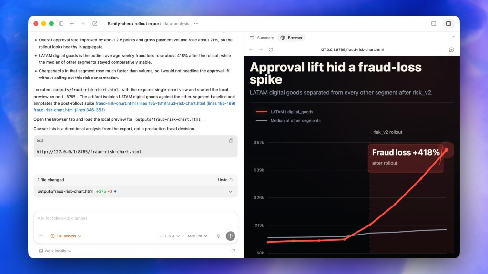

# AI 周报

> **2026/04/17 – 04/19**
> **本期主题：Anthropic 冲进应用层；开发者工作台变成通用 Agent 平台**

---

## 本周结论

> **核心判断：** 本周两条产品主线同时清晰：**应用层**上，Claude Design 把「prompt → 可交互原型 / 物料」做成独立产品，Anthropic 从模型供应商跨入与 Figma、Canva 重叠的场景；**开发者侧**，Codex Desktop 以 Computer Use、内置浏览器与定时自动化把「写代码」扩展为「操控整台电脑」，与 Claude Code 的并行 session、Routines 形成正面竞争，**workspace agent** 的形态正在收敛。模型层则出现 **benchmark 与实际任务的分裂**：Opus 4.7 在窄任务榜单上仍领先，但独立评测显示长上下文检索明显退化——凡依赖长 context 的 agent / skill，都需要自建验证，而不能只看厂商分数。

---

## 模型模块

本周模型层没有新的旗舰发布，真正的信号是 **Opus 4.7 在实际任务上与 benchmark 分数出现系统性分裂**——对所有依赖长上下文的 skill/agent 设计者是必须注意的风险。

### M1｜Opus 4.7 的"能力悖论"

| 模块 | 具体详情 |
|------|---------|
| 总结 | **TL;DR：** 长文本检索显著退化（独立 MRCR 复现），短任务 benchmark 仍领先——长 context 场景务必自建评测。 |
| 关键发现 | ● Epsilla（4/18 分析）复现：**MRCR 长文本检索准确率从 Opus 4.6 的 78.3% 跌至 32.2%**，模型在找不到信息时倾向于"自信编造"而不是承认未知 ● SWE-bench / Terminal-Bench 这类窄任务 benchmark 仍然领先，但 **benchmark 高分与长 context 实用性之间的差距被拉大** ● 一些 Cursor / Claude Code 用户报告长 session 下的工程质量下滑，与 4.6 相反的体验 |
| 落点 | ● 影响所有长 context 场景：RAG、代码库级重构、多文件 agent、知识库问答 ● 不影响短任务：单文件修复、benchmark 类任务仍然稳定 ● Anthropic 尚未官方回应，社区推测与新 tokenizer 或 adaptive thinking 有关 |
| 对 skill 设计的含义 | ● 做 context 密集型 skill 时，不能把"模型能读更长上下文"作为免费假设——必须显式检索 / 摘要 / 分段 ● 对"模型会承认不知道"的依赖要降低，加一层显式验证（让模型列出它用的 source，或让第二个 pass 复核） ● 选型时区分：短任务用 Opus 4.7 没问题，长 context 任务保守使用或保留 4.6 fallback |
| 我们的动作 | 在 V1 skill 原型中加入 context 长度的显式分档：短（<32k，直接调 Opus 4.7）/ 中（32–128k，分段摘要后再推理）/ 长（>128k，走检索而非直接塞入）。不要等 Anthropic 修复。 |

| 官方声明 | 外部验证 |
|---------|---------|
| Opus 4.7 SWE-bench Verified 87.6%，Terminal-Bench 2.0 69.4%（上周发布数据） | Epsilla MRCR 独立复现 32.2%；HN (#47793493) 多个用户报告长 session 质量退化；Artificial Analysis 尚未给出最终评分 |

| 社区反馈 | 编辑判断 |
|---------|---------|
| 开发者社区在"4.6 还是 4.7"问题上分裂：短任务选 4.7，长任务有人回退到 4.6 | 这是一个典型的"**benchmark 工程化**"信号——厂商在 benchmark 集上越来越会做，实际分布外的能力反而下降。我们作为 downstream 必须自建评估。 |

> "关掉 adaptive thinking、用更高默认 thinking budget 后 4.6 的质量才回来，4.7 在我的长 context 代码任务上反而不如 4.6。不管他们内部评测说什么，这不是我要的那种'能力跳升'。" — HN 用户，#47793493 讨论串

> "MRCR 从 78 跌到 32，这不是统计噪声，是架构或训练目标的变化。任何把长文档塞给 Claude 让它自己找答案的系统都要重新测一遍。" — Epsilla 4/18 分析

---

## 产品模块

本周产品层的主线：**从工具到平台的跨越**。Claude 从聊天跳进设计；Codex 从写代码跳进操控桌面。

### P1｜Claude Design — Anthropic 正式进入设计应用层

| 模块 | 具体详情 |
|------|---------|
| 总结 | **TL;DR：** 首款面向终端的设计应用层产品：自然语言直达原型/物料，直接切入 Figma/Canva 场景。 |
| 核心定位 | "prompt → 可交付设计产物"的端到端工具——不是辅助设计，而是替代设计工具的起步阶段。 |
| 产品重点 | ● 自然语言描述需求 → 生成交互原型、多屏应用、slide deck、落地页、营销素材 ● **设计系统自动识别**：初次使用时读取团队代码库和设计文件，自动构建配色 / 字体 / 组件规范并持续应用 ● 精修交互四通道：对话 / 行内批注 / 直接编辑 / 自定义调节滑块（间距、颜色、布局） ● 输入支持文本、图片、DOCX / PPTX / XLSX 文件导入并重新设计 ● 导出到 **Canva / PDF / PowerPoint / HTML**，可直接交接给 Claude Code 开发 ● Figma MCP 集成：从 Figma 拉取设计上下文，生成对齐的代码 |
| 用户场景 | ● 产品经理：一句话生成 PRD 配套的交互原型，会议结束前拿到可点击的 demo ● 营销团队：从 brief 到社媒素材套件，跳过 Figma → Canva 的手工流程 ● 创始人 / 独立开发者：从想法到 pitch deck 到落地页到前端代码，单一工具链完成 |
| 商业模式 | Research preview，Pro / Max / Team / Enterprise 用户免费可用，消耗现有订阅额度。**Canva 宣布合作而非竞争**——Claude Design 草稿可推送至 Canva 继续编辑。 |
| 用户反馈 | 好：● 学习平台 Brilliant 报告最复杂页面从 20+ 次 prompt 迭代降至 **2 次**——迭代效率提升 90% ● 设计系统自动识别解决了"AI 设计千篇一律"的核心痛点 ● 有团队描述"从粗想法到可工作原型，整个过程在一次会议内完成" 坏：● Token 消耗极高——有测试者用一个设计系统 + 原型消耗了 **50% 的 Pro 周额度** ● 尚不支持多人协作（无共享光标、无实时评论） ● Figma MCP 需要升级版 Figma 计划，免费用户无法使用 Dev Mode |
| 与我们的关系 | **直接冲击**。Claude Design 的"prompt → 设计系统 → 可交付原型"链路与我们的创作 skill 愿景高度重合。差异化方向：Claude Design 是通用设计工具，我们做**垂直创作领域**（素材理解 → 风格学习 → 成品输出），在深度上超过它的通用宽度。 |

*Claude Design：自然语言描述需求后生成的交互原型，支持行内批注和调节滑块精修（来源：Anthropic Labs 官方发布页）*

*Claude Design 自动识别团队设计系统：读取代码库和设计文件，构建可复用的品牌规范（来源：Anthropic，经 TechCrunch 转载）*

| 官方声明 | 外部验证 |
|---------|---------|
| Research preview，支持原型 / slide / 落地页 / 营销物料生成，可导出到 Canva / PDF / Claude Code | Brilliant 报告 90% 迭代效率提升；InsideHook 称"互联网炸了"；Canva 宣布合作集成 |

| 社区反馈 | 编辑判断 |
|---------|---------|
| 高度关注但 token 消耗是普遍槽点；设计师群体态度分裂——兴奋与威胁感并存 | 本周最重要的产品事件。Anthropic 从模型公司跨入应用层的第一步，直接验证了"AI-native 设计工具"的可行性 |

> "从粗想法到可工作的原型，以前需要一周，现在一次对话就搞定了——这不是优化，是流程消失了。" — Claude Design 早期用户（Anthropic 官方案例）

> "用了一个设计系统加一轮原型调整，我 Pro 计划一半的周额度就没了。这个定价模型在生产环境根本不可持续。" — Medium 评测

> "Claude Design 能造出你要的任何东西，但它无法告诉你那东西好不好看——设计判断力仍然完全在人这边。" — r/ClaudeAI 用户

---

### P2｜Codex Desktop 重大升级 — 从代码工具到桌面 Agent 平台

| 模块 | 具体详情 |
|------|---------|
| 总结 | **TL;DR：** 全桌面 agent：Computer Use + 内置浏览器 + 定时自动化——与 Claude Code 竞争「整台电脑的 workspace」。 |
| 核心定位 | 通用 workspace agent——不只写代码，还能看屏幕、点鼠标、开浏览器、排日程、记上下文。 |
| 产品重点 | ● **Computer Use**：Codex 可以看到、点击、输入 macOS 应用，后台多 agent 并行工作不打扰用户 ● **内置浏览器**：基于 Atlas 技术，可打开本地/公网页面，直接在渲染页面上批注下指令 ● **图像生成**：集成 gpt-image-1.5，无需切换到 ChatGPT ● **111 个新插件**：集成 CircleCI / GitLab / Atlassian / Microsoft Suite 等 ● **Thread Automations**：定时任务调度，跨天/跨周保持上下文 ● **Memory**：跨 session 记忆用户习惯和项目规范 ● **远程 SSH**（alpha）+ 多终端标签 + GitHub PR Review 集成 |
| 用户场景 | ● 设置"每周五自动跑回归测试 + 生成修复 PR"——定时 agent 工作流 ● Computer Use 测试原生 Mac 应用的 GUI 流程——不需要手动操作模拟器 ● 内置浏览器 + 批注：看到页面渲染结果后直接告诉 Codex 要改什么 |
| 商业模式 | Mac 用户可用（Computer Use 不对欧盟 / 英国 / 瑞士开放）。$20/月起。Token 效率是优势：同等任务用量约为 Claude Code 的 **1/4**。 |
| 用户反馈 | 好：● 有开发者称"我已经不打开 IDE 了，完全靠 Codex agent 管理" ● WorkOS 团队报告明确范围任务成功率达 **85–90%** ● 定时自动化 + 记忆功能使 Codex 成为持续运行的开发伙伴 坏：● macOS 资源消耗严重——即使空闲状态也占 **15–20W** 功耗（正常 4–5W） ● Computer Use 仅 Mac，Windows 用户暂时无法使用 ● 复杂架构决策仍需切换到其他工具 |
| 与我们的关系 | Thread Automations + Memory 组合意味着"持续运行的 agent"不再是概念。与 Claude Code Routines 形成正面竞争，印证了"定时 agent 工作流"的产品化方向。我们的 skill 系统可以对标这两者的调度层设计。 |

*Codex Desktop Computer Use：AI 请求操作 macOS 应用时的权限确认对话——后台多 agent 并行不打扰用户工作（来源：OpenAI Codex 官方开发者文档）*

*Codex 内置浏览器：基于 Atlas 技术的 Artifact Viewer，在渲染页面上直接批注、下达修改指令（来源：9to5Mac）*

| 官方声明 | 外部验证 |
|---------|---------|
| Computer Use + 内置浏览器 + 图像生成 + 111 插件 + Thread Automations + Memory | WorkOS 85-90% 成功率；9to5Mac / ZDNet / VentureBeat 独立评测确认；GitHub issue 确认功耗问题 |

| 社区反馈 | 编辑判断 |
|---------|---------|
| 开发者社区分裂为 Codex 派和 Claude Code 派；功耗问题是主要抱怨 | Codex 和 Claude Code 的竞争从"谁写代码更好"升级到"谁是更好的 workspace agent"——这是产品形态的根本变化 |

> "我已经不打开 IDE 了。现在我的日常是管理一小队 agent 帮我写代码，而不是自己写。" — Substack 开发者日志

> "Codex 在明确范围的批量任务上成功率很高，85-90%。但复杂架构问题还是得换别的工具。" — WorkOS 团队

> "这 app 即使什么都没做也在吃 15-20 瓦电……我的 MacBook 风扇一直转。" — GitHub issue #10885

---

## 本期初创聚焦｜rtrvr.ai — AI Subroutines

| 模块 | 具体详情 |
|------|---------|
| 总结 | **TL;DR：** 「学一次 → 零 token 重放」把浏览器自动化边际成本压到接近零。 |
| 核心机制 | ● 录制一次网页操作，后续重放**零 token、零推理延迟** ● 脚本在页面内原地执行，自动继承身份验证 / CSRF 保护，无需外部代理架构 ● 智能过滤把网络请求从数百个精简到 **~5 个** ● 支持 ChatGPT / Claude 订阅直接 OAuth 登录，不需要单独 API 账单 |
| 典型场景 | ● WhatsApp 消息触发自动化、语音输入 prompt、结果自动推送到 Google Sheets ● Instagram DM / X 发帖 / LinkedIn 邀请等社交平台批量操作 |
| 为什么关注 | 当所有人用 LLM token 驱动浏览器自动化时，rtrvr.ai 选了另一条路：**AI 只负责"学习一次"，之后用确定性脚本执行**，把边际成本从"每次都要推理"降到接近零。对我们的 skill 系统是直接启发——**一次性编译的 skill vs. 每次重新推理**可能才是正确的成本曲线。 |

---

## 简讯

| 名称 | 一句话 |
|------|-------|
| **Grok 4.20 Beta 2** | xAI 在医疗和法律推理 leaderboard 登顶；内置 4-agent 辩论架构，幻觉率降低 **65%** |
| **GPT-Rosalind（生命科学专用）** | OpenAI 首个垂直模型，BixBench 0.751 领先；Trusted Access 限美国合规企业，与我们方向无直接关系，仅作信号：大厂开始做垂直专用模型 |
| **Lovable AI 渗透测试** | Vibe coding 领域首个自动化渗透测试，AI agent 集群扫描 OWASP Top 10，替代 $5K–$50K 传统安全审计 |
| **Mistral Studio Connectors** | 4/15 发布，支持内置 + 自定义 MCP 连接器、工具调用、人工审批流——低调但实用 |
| **DeepSeek V4 逼近** | 创始人内部确认**四月底发布**；万亿参数 MoE、百万 token 上下文、华为昇腾 950PR 芯片首发适配 |
| **Codex Life Sciences 插件** | 随 GPT-Rosalind 发布，免费 GitHub 可用，连接 50+ 科研工具——Codex 开始做垂直领域插件生态 |

---

## 编辑部判断

**趋势**

1. **模型公司入侵应用层。** Claude Design 是标志性事件：Anthropic 不再只卖 API，开始直接做终端用户产品。模型公司和应用公司的边界正在消失——对纯应用层创业公司是实质性威胁，**我们做垂直创作 skill 的时间窗不是很长**
2. **Workspace agent 趋同。** Codex 和 Claude Code 同时从代码工具进化为操控桌面 + 定时调度 + 记忆上下文的通用 agent 平台。开发者工具的终局形态正在收敛，**"定时运行的 skill"已经被两家同时做成产品**
3. **Benchmark 与实用性出现分裂。** Opus 4.7 MRCR 长文本退化是典型信号：模型在测试集上越来越会做，但实际长任务质量没有单调上升。**我们必须自建 eval 而不是依赖厂商 benchmark**

**项目动作**

- **本周必做：** 深度试用 Claude Design，记录它解决不了的垂直创作场景——这些就是我们的切入点
- **本周必做：** 测试 Codex Thread Automations vs Claude Code Routines 的调度能力对比，选一个作为我们 skill 的调度底座
- **立刻调整：** V1 skill 原型中为 Opus 4.7 长 context 退化加 fallback（显式检索 + 分段摘要），不要等 Anthropic 修复
- **V1 方向确认：** Claude Design 验证了"prompt → 设计产物"可行，我们的差异化**必须在垂直深度**（素材 → 风格 → 成品），不是通用宽度

**下周监控**

- DeepSeek V4 是否如期发布 + 华为芯片实际推理性能
- Claude Design 从 research preview 到稳定版进展 + token 消耗优化
- Anthropic 对 Opus 4.7 长文本退化的官方回应
- Adobe Firefly AI Assistant beta 时间线（上期遗留）

---

## 参考来源

### 模型
- Epsilla｜Opus 4.7 Paradox 分析（benchmark vs 实际场景退化 / MRCR 基准）｜2026-04-18
- HN｜Opus 4.7 讨论串 #47793493（长 session 质量退化报告）｜2026-04
- xAI｜Grok 4.20 Beta 2 + 多 Agent 架构｜2026-04 中旬

### 产品
- Anthropic Labs｜Claude Design 发布（via TechFlowDaily / InsideHook / Blockchain.News）｜2026-04-17
- OpenAI｜Codex Desktop 重大升级（via 9to5Mac / ZDNet / VentureBeat）｜2026-04-16
- rtrvr.ai｜AI Subroutines v33（via BotBeat）｜2026-04-15
- Lovable｜AI 渗透测试（via CreateWith / DEV Community）｜2026-04 中旬
- Mistral｜Studio Connectors MCP（via Mistral 官方）｜2026-04-15
- DeepSeek｜V4 发布预告（via multiple sources）｜2026-04
